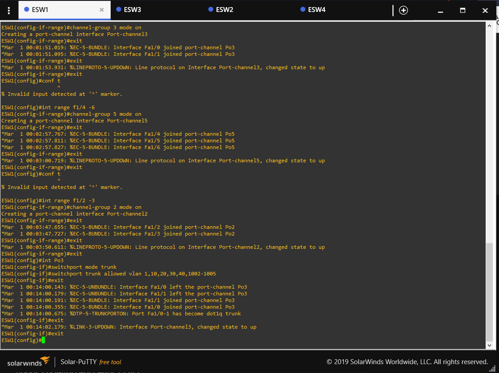
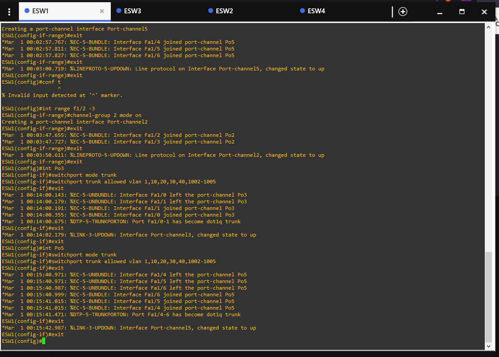

# CONFIGURACION TOPOLOGIA 2   

* CONFIGURACION DE LOS "VTP"
En esta configuracion se modifica el dominio que trae por defecto
y se coloca una contrasena. Adicioanalmente se configura
si el switch sera cliente o servidor.
```
conf t
vtp domain [identificador del grupo]
vtp password [contrasena para el grupo]
vtp mode [modo server/client]
end
```
### MODO SERVER ESW4

### MODO CLIENTE ESW1

### MODO CLIENTE ESW2

### MODO CLIENTE ESW3


* CONFIGURACION DE LOS "TRUNK"
Hay conexiones que deben ser troncales, en este caso vemos 
la configuracion necesaria para poder colocarlas como
troncales. Indicando el modo y las vlans permitidas
```
conf t 
int [identificador del puerto]
switchport mode trunk
switchport trunk allowed vlan 1,10,20,30,1002-1005
exit
```
### ESW1


### ESW2


### ESW3


* CONFIGURACION DE LOS "SWITCH"

### ACCESS VLAN SWITCH 1


### ACCESS VLAN SWITCH 2


### ACCESS VLAN SWITCH 3


### TRONCAL SWITCH 1


### TRONCAL SWITCH 2


### TRONCAL SWITCH 3


### TRONCAL SWITCH 4 NUVES Y ROUTER


* SHOW PORT Y SUMMARY

### ESW1

### ESW2

### ESW3

### ESW4


* ROUTER

### ACTIVAR PUERTOS TRUNK R1

### DHCP 1

### DHCP 2


* CONFIGURACIONES DEL ESW1

### MODO TRUNCAL Y VLANS
| Po2 | Po3 | Po5 |
| ------------ | ------------- | ------------- |
|  |  |  |